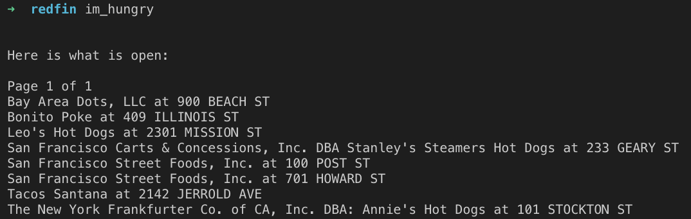

# ImHungry



## If this was a web application...

I think speed and availability are the most important features to improve on for a web application. I noticed all of the start and end times are always on the hour. We can use this to our advantage by pre-filtering and pre-sorting the food trucks for every hour of the week.

I would fetch the data as a daily / hourly background worker and store the response in a database. Once the fetch worker is successful and complete, another worker would bucket the food trucks into an in-memory key/value data store (redis or memcache). The keys of this cache would be the `day_of_week,hour_of_day`. In O(1) time, we could retrieve a sorted list at any hour. The bucket cache will consume worst-case additional 8.4MB of memory [0]. This will make reads super quick since we will not need to filter and sort. Assuming N trucks with K trucks in the current hour, the complexity costs of filtering and sorting is O(N + Klog(K)).

This approach will have high availability since it will not be dependent on external services since the web requests will always retrieve the data from our own servers.

[0] - 24 hours * 7 days * 50 bytes * 1000 trucks = ~8.4 megabytes if we have 1000 trucks open 24/7.

## Installation

Add this line to your application's Gemfile:

```ruby
gem 'im_hungry'
```

And then execute:

    $ bundle

Or install it yourself as:

    $ gem install im_hungry

## Usage

`$ im_hungry`

Example output:

```
$ im_hungry

Here is what is open:

Page 1 of 2
Bay Area Dots, LLC at 900 BEACH ST
Bonito Poke at 409 ILLINOIS ST
Casey's Pizza, LLC at 1 POST ST
Expresso Subito, LLC. at 150 CALIFORNIA ST
```

## Development

After checking out the repo, run `bin/setup` to install dependencies. Then, run `rake spec` to run the tests. You can also run `bin/console` for an interactive prompt that will allow you to experiment.

To install this gem onto your local machine, run `bundle exec rake install`. To release a new version, update the version number in `version.rb`, and then run `bundle exec rake release`, which will create a git tag for the version, push git commits and tags, and push the `.gem` file to [rubygems.org](https://rubygems.org).

## License

The gem is available as open source under the terms of the [MIT License](https://opensource.org/licenses/MIT).
